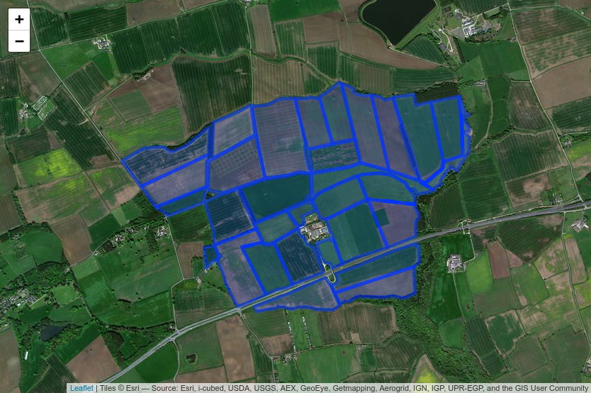
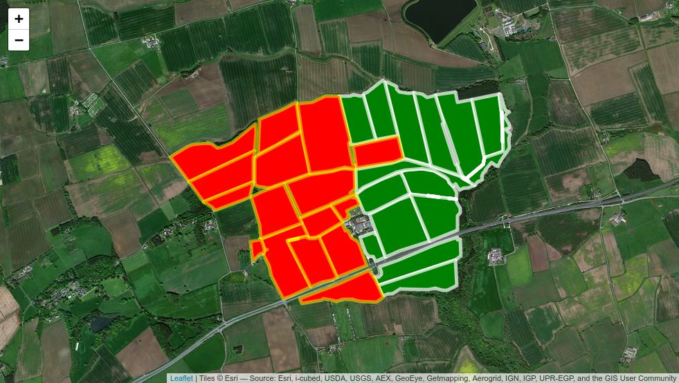
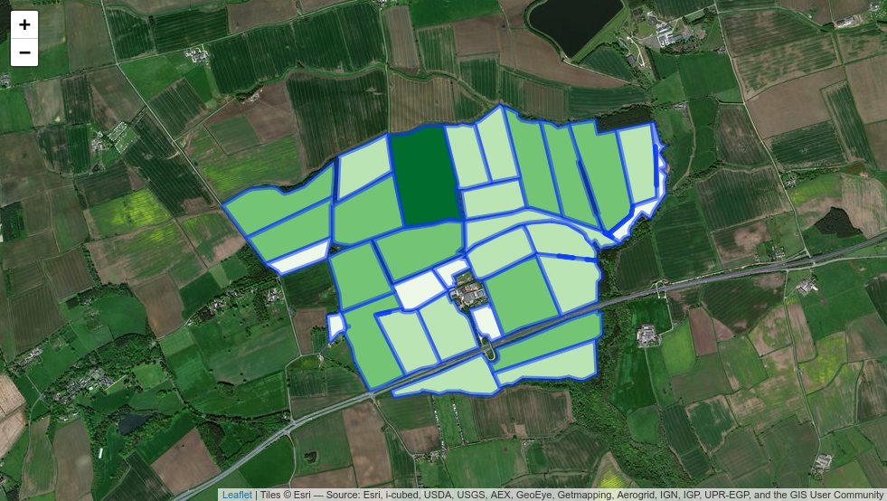
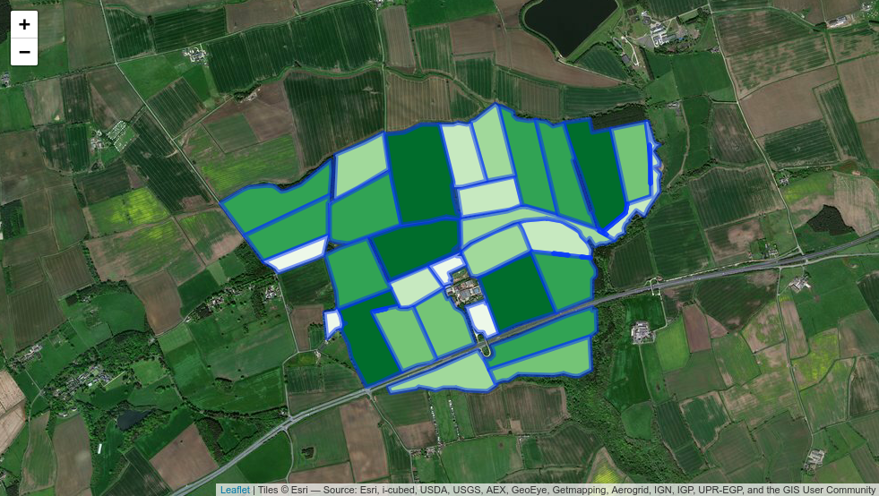
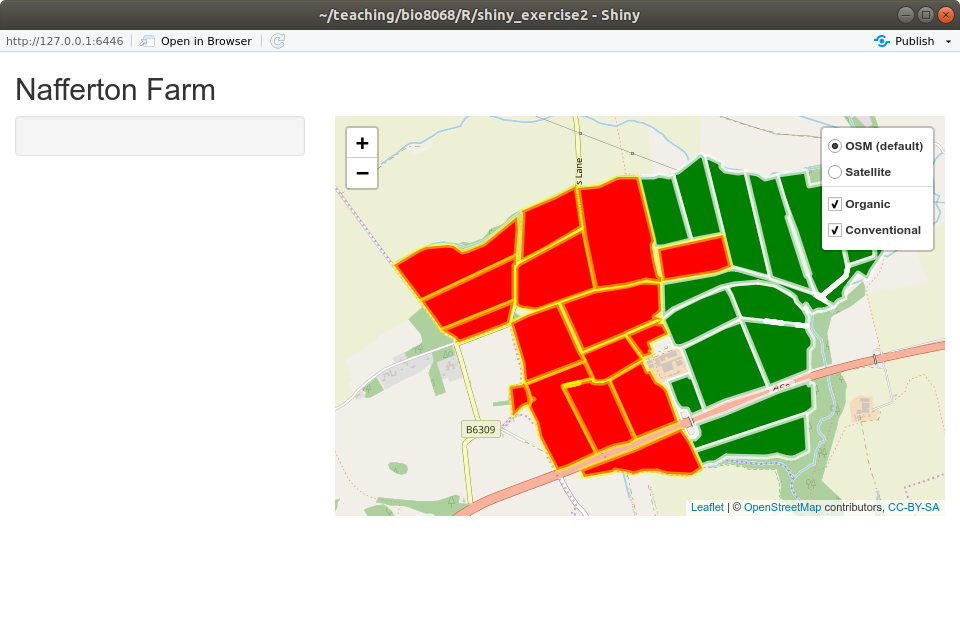

```{r setup, include=FALSE}
knitr::opts_chunk$set(echo = TRUE)
```

You have already looked at the basics of spatial data management in R, both in this module and BIO8069. Shiny has a number of features that allow users not only to display spatial data, but also interact with it, query features etc. Similar to ArcGIS, you can display backdrop maps, raster maps and feature (vector) maps, and the simple features `sf` and `raster` packages are both particularly useful.

# Aims of this practical
Introduce you to spatial data display in Shiny, in particular:

* the `leaflet` and `leafem` packages to display backdrop maps
* coordinate systems and overlaying raster and vector maps
* interrogating maps using point and click mouse actions

# 1. The `leaflet` and `leafem` packages
## 1.1 Installing `leaflet`, `leafem` and setting up a project
Begin by installing `leaflet` and `leafem` in the usual way, and if you have not already done so, also install the `mapview` package. The `leafem` provides some additional useful functions when displaying information on maps. Next, create a new Shiny project, with git version control, called **shiny_exercise2**.  The `leaflet` package is now widely used to display interactive web-based maps, including major newspapers such as the Washington Post. Financial Times and New York Times websites.  **You can use it outside of shiny, and also within a conventional R session**. The `mapview` package allows easy interactive scroll, pan and zoom of maps within RStudio.

We will begin with a simple R session; **create a new R script called `learn_leaflet.R`** and enter:

```{r, eval=FALSE}
library(leaflet)
library(leafem)
library(mapview)

# Create the map
my_map <- leaflet() %>%
   addTiles() %>%  # Add default OpenStreetMap map tiles
   addMarkers(lng=-1.6178, lat=54.9783,
              popup="World's most important city!")

my_map  # Display the map in Viewer window
```

Only three lines were needed to create your map, called `my_map`. Notice that `leaflet` accepts `tidyverse` pipe `%>%` symbols, so that you can "chain" commands together.  Putting the output into an R object, here `my_map` (what class is it??) is optional, but often useful as you build up separate elements of a map.  Unlike previous maps, this is dynamic, you can zoom and pan around the map, and click on the marker.  Notice that the `addMarkers()` function took Newcastle University's coordinates in **latitude-longitude**, not Ordnance Survey. This can be a nuisance, as sometimes you may have to reproject between different coordinate reference systems (CRS). You therefore have to be alert not only to whether you map is raster or vector, but also the CRS.

http://leaflet-extras.github.io/leaflet-providers/preview/ 

If you enter the `providers` as `providers$` then hit the TAB key in RStudio a list of possible maps will be displayed. Note that some require registration or do not cover the UK.  Ones you might find useful are `Esri.WorldImagery` and `Esri.WorldShadeRelief`, but explore other backdrops as there is now a large range of backdrops.

## 1.2 Multiple backdrop maps
As with ArcGIS and QGIS you can add multiple backdrop maps, but then run the risk of one being too opaque and covering underling maps.  You can therefore modify the 'transparency' of different maps.  For example, the following code will show the satellite map, overlain with the main roads, and the names of the main roads

```{r, eval=FALSE}
leaflet() %>% 
   addProviderTiles(providers$Esri.WorldImagery) %>% 
   addProviderTiles(providers$Stamen.TonerLines,
                    options = providerTileOptions(opacity = 0.5)) %>%
   addProviderTiles(providers$Stamen.TonerLabels) %>% 
   addMarkers(lng=-1.6178, lat=54.9783,
              popup="World's most important city!")
```

Note that the second `addProviderTiles()` line is split over two lines of code:

```{r, eval=FALSE}
   addProviderTiles(providers$Stamen.TonerLines,
                    options = providerTileOptions(opacity = 0.5)) %>%
```

Although you could write it on one line, as you include more mapping options the call to a function can start getting too long to read easily. It can make your code clearer and easily to read by splitting over multiple lines. Just **ensure that the preceding line ends in a comma at an option change** and RStudio will automatically detect the continuation, and indent the next line automatically.

Try changing the opacity of different layers.  Notice that here we are not saving the map into a leaflet object (`my_map` in the first example) but rather sending the map directly to the screen.

## 1.3 Changing marker symbols
Sometimes it is useful to be able to change the colour of a marker, for example to identify points representing different features, or the size of a marker, to indicate quantities or amounts. Circle markers are particularly useful for this:

```{r, eval=FALSE}
leaflet() %>%
   addTiles() %>%  
   addCircleMarkers(lng=-1.6178, lat=54.9783,
                    popup="The world's most important city!",
                    radius = 5, color = "red")
```

You can also use options to change the fill colour, opacity (transparency) of the Circle Markers. Look up the help for addCircleMarkers and experiment with some of these. **Practice exercise**: Given that London is at 51.5074 N and 0.1278 W, and the population Newcastle upon Tyne is 270,000 whilst that of London is 8,000,000 try and produce a map with markers roughly proportional to the populations of the two cities, selecting Circle Marker colours and symbols as you think best.

## 1.4 Marker labels versus marker popups
Use of a marker `label` gives you more formatting control than a `popup`. The standard `popup` requires the user to click on a marker to display the text, but if instead you use the `label` option **instead** of `popup` the text will be displayed just be hovering the mouse. Modify the code in one of your earlier examples to try this out. You have greater control using the `labelOptions` to adjust text size, font, bounding box etc.  The format of the function is still within the `addMarkers` or `addCircleMarkers` function, for example:

```{r, eval=FALSE}
addCircleMarkers(lng=-1.6178, lat=54.9783,
      label="Newcastle population 270k",  # Note change to label
      labelOptions = labelOptions(textsize = "15px")
```

Investigate label options such as `noHide`, `direction`, `textOnly` to understand the effects on the displayed map.

# 2. Vector maps and leaflet
## 2.1 Introduction
Unfortunately R has a number of different methods for storing both raster and vector data, but leaflet aims to be compatible with most of the main packages. It can also handle raw two-column data (of latitudes and longitudes), although this can be more restrictive. The two main packages you are likely to encounter are:

* `sp` package
* `sf` (simple features) package

We will focus on the newer `sf` package which is likely to replace sp in the long-term, but for some importing of data `sp` is still needed; the sf package also has the advantage of being `tidyverse` compliant. I highly recommend the book Geocomputation in R, which is freely available online for a full explanation of R's spatial data handling:

https://geocompr.robinlovelace.net/ 

Download the naff_fields* files from Canvas (.shp, .dbf, .prj, .shx) and store them in a `www` folder in your `shiny_practical2` project folder. Note that you do not need to store data files in a `www` folder to use `leaflet`, but `shiny` expects data to be stored there, so it is convenient to put the data there initially.

```{r}
library(sf)
nafferton_fields <- st_read("www/naff_fields.shp")
```

The `st_read` function is part of the `sf` package, and after import you should see something similar to the above displayed. The data were originally from the GRASS GIS software system, which uses a different method of handling coordinate reference systems. The data are on the Ordnance Survey National Grid, which can be shown by

```{r, eval=FALSE}
st_crs(nafferton_fields)
```

This spews out rather a lot of output, and near the top you can see that the `DATUM` is correctly `OSGB 1936`. However, the EPSG code is not set to the more usual 27700 that is now used for the island of Great Britain, so we will transform the data to that projection. Note that the island of Ireland uses a different projection system. Also, as the `leaflet` functions expect data in **latitude longitude** we will transform the result to a `nafferton_fields_ll` map for use later. These reprojections are carried out via the `st_transform` function:

```{r}
# First reset nafferton fields to OS 27700. Depending on the source of your data
# you may not always need this first step
nafferton_fields <- nafferton_fields %>% 
   st_set_crs(27700) %>% 
   st_transform(27700)

# Transform to latitude longitude
nafferton_fields_ll <- st_transform(nafferton_fields, 4326) # Lat-Lon
```

EPSG codes, which stands for "European Petroleum Survey Group" (!) provide an easy way of re-projecting your data. You may not always encounter this issue, and will probably be able to simple use `st_transform()` directly to swap back-and-forth between projection systems.

You can plot these data directly with the `plot()` function and should see something similar to:

```{r, echo=FALSE}
plot(nafferton_fields)
```

A warning is displayed as by default `plot()` does not show all the maps. You can also type the name of the `nafferton_fields` object directly into the RStudio Console to inspect its contents. You can see it has a tabular structure. Inspect the columns of nafferton_fields (the first 10 are displayed) and note how they relate to the information in the maps.  Some columns are not relevant, such as cat or Toid etc., so you can experiment now to just display single maps of one variable **hint**: Experiment with square brackets. You can also plot just a single column from the table using this trick.

Now, using the **longitude latitude** version of your map, try displaying it in leaflet.

```{r, eval=FALSE}
leaflet() %>% 
   addProviderTiles(providers$Esri.WorldImagery) %>% 
   addFeatures(nafferton_fields_ll)
```
 
 

You can zoom and pan this map, but not much else.

## 2.2 Displaying subsets of vector data
Remember that you can subset a simple features dataset based on criteria in the attribute data. For example:

`nafferton_fields_ll[nafferton_fields_ll$Farm_Meth=="Organic",]`

Here we have subset the data to only show the organic agriculture. Based on this, adopt the code you used earlier to produce a map like the following:



Hint: use two separate calls to the addFeatures function. Look up the help for addFeatures, and also addPolygons, especially opacity and color (American spelling) options.

## 2.3 Continuous colour options
Of course, the `nafferton_fields_ll` object actually contains much more information than merely the crop management.  You might, for example, want to colour the fields according to a continuous variable, such as the area of each field. This is relatively straightforward; first you have to decide how to split up your continuous variable (field area) into different categorical ‘bins’, and then apply a colour pallette (using the `colorBin` function) to define the categories.

Begin by exploring the range of values for the `Area_m` column, using the summary command, and plotting a histogram: use the default histogram command `hist()` remembering that you can address a single column using `$` followed by the column name. Also for practice use `ggplot2` with the `geom_histogram()` function. **Hint**: to obtain an attractive plot you will probably want to set binwidth to about 25000 square-metres.

Think back to the BIO8069 GIS & Remote Sensing lectures and practicals, and you will recall that there are different ways of colouring as continuous variable on a map. You could for example aim to ensure that a similar area is encompassed by each colour class. The field areas at Nafferton run from approximately 12,000 to 200,000 square metres, therefore possible bin categories could be 25k, 50k, 100k, 150k, 200k square metres. To show this in leaflet, we define the bins, set the colour pallette, then apply the pallete in the map. I've chosen green colour pallete as plants are green...

```{r, eval=FALSE}
# Set the bins to divide up your areas
bins <- c(0, 25000, 50000, 75000, 100000, 125000, 150000, 175000, 200000, 225000)

# Decide on the colour palatte
pal <- colorBin(palette = "Greens", domain = bins)

# Create the map
leaflet() %>% 
   addProviderTiles(providers$Esri.WorldImagery) %>% 
   addFeatures(nafferton_fields_ll,
               fillColor = ~pal(nafferton_fields_ll$Area_m),
               fillOpacity = 1)
```



Notice that only about 4 shades of green are showing (a handful of fields coloured almost white, lots coloured light-green or mid-green, and one coloured dark green). **Question** Why might this be happening? Look at the help for the `colorQuantile` function, and adapt your code to change your `pal` to show six colour categories as below. Recall that quantiles will be based on the distribution of percentages (or proportions) of field areas, rather than using arbitray cutoff values that you used for `bins` plus `colorBin()`:



Finally, it is useful to add a legend.  To save repeated calls to `nafferton_fields_ll` in the code it is easier to include the `sf` object as an "argument" to the `leaflet()` function. Here we show the results using our pre-defined bins with `colorBin`, but you could also use `colorQuantile`:

```{r, eval=FALSE}
pal <- colorNumeric(palette = "Greens", domain = bins)

# Now leaflet is called with nafferton_fields_ll
leaflet(nafferton_fields_ll) %>% 
   addProviderTiles(providers$Esri.WorldImagery) %>% 
   addFeatures(fillColor = ~pal(Area_m),
               fillOpacity = 1) %>% 
   addLegend("bottomright",
             pal = pal,
             values = ~Area_m,
             title = "Field area",
             labFormat = labelFormat(suffix = " m^2"),
             opacity = 1)
```

## 2.4 Highlights and popups
To make your vector map more interactive, you can highlight individual polygons when the mouse is moved over them. This is easy to implement via the `highlightOptions()` function. Add the following to your `addFeatures()` call, and note the effects. Try experimenting with different colours and weightings:

```{r, eval=FALSE}
highlightOptions = highlightOptions(color = "yellow",
                                    weight = 5,
                                    bringToFront = TRUE)
```

Likewise, you might want to show a popup, as you have done for individual markers, to display information about the crop type, management etc. The simplest method is to create a variable to contain the information you want to popup when you click on a mouse in a field, and then add this to the popup option as before:

```{r, eval=FALSE}
field_info <- paste("Method: ", nafferton_fields_ll$Farm_Meth,
                    "<br>",
                    "Crop: ", nafferton_fields_ll$Crop_2010)
```

**Question**: what is the `<br>` used for? What happens if you remove it? Try other settings such as `<strong>` or try displaying other information in a succinct form in a popup. How might you display area in hectares rather than square metres?

## 2.5 Interactive control of foreground and background maps
So far all the leaflet maps you have produced have displayed the same background content, and the same foreground overlays. However, they are relatively easy to modify so that the user can interactively change what is displayed. First, let’s give the user the choice of displaying either the satellite map or Open StreetMap (OSM) as a backdrop, using the group, `baseGroups` and `addLayersControl` options:

```{r, eval=FALSE}
leaflet() %>% 
   addTiles(group = "OSM (default)") %>% 
   addProviderTiles(providers$Esri.WorldImagery,
                    group = "Satellite") %>% 
   addLayersControl(
      baseGroups = c("OSM (default)", "Satellite")
   )
```

As you have not defined a region of interest, nor an overlay map, this will actually display a map of the whole planet, with the default OSM backdrop.  Note however that there is a small button at the top-right of the map, which allows the user to interactively switch to and from the satellite and OSM maps. To ensure that the map is focussed on north east England, without displaying an overlay (foreground) map you need to set the view:

`setView(lat = 54.9857, lng=-1.8990, zoom=10)`

**Question**: why is the longitude negative? Experiment with different zoom levels and observe the effect.

Now add the overlay map for the whole of Nafferton farm:

```{r, eval=FALSE}
leaflet() %>% 
   addTiles(group = "OSM (default)") %>% 
   addProviderTiles(providers$Esri.WorldImagery, group = "Satellite") %>% 
   addFeatures(nafferton_fields_ll, group = "Nafferton Farm") %>% 
   addLayersControl(
      baseGroups = c("OSM (default)", "Satellite"), 
      overlayGroups = "Nafferton Farm",
      options = layersControlOptions(collapsed = FALSE)
   )
```

What do you think the `layersControlOptions` is doing?

**Exercise**: modify the preceding code, so that the user can interactively display either the organic or conventional or both parts of the farm (using the colour scheme outlined in Section 2.2 above), overlaid onto e.g. OSM, ESRI imagery, topography. **Hint**: if you hit the tab key after entering `providers$` you will see additional backdrop maps, some of which might be useful.


# 3. Integration with shiny
## 3.1 Introduction
Maps created with `leaflet` integrate well with `shiny`, so that they can be viewed through a web browser. However, **shiny is difficult to debug**, so it is usually best to **ensure that your leaflet code is working correctly outside of shiny first**. Displaying a leaflet map is similar to other shiny displays, in that you need separate calls in the ui and server functions. The key changes needed are:

* load both `library(shiny)`, `library(leaflet)` and `library(leafem)` at start of code
* ui should contain a call to `leafletOutput`
* server should contain a call to `renderLeaflet` which expects to receive a `leaflet` map

As you began this practical by creating a new shiny project, it will automatically have created a standard `app.R` that displays ‘Old Faithful’ geyser data. This uses the `sidebarPanel` layout. To begin, in the `ui` interface section, comment out the five lines that describe the `sliderInput` within the `sidebarPanel`. A `sidebarPanel` will still be available should you wish to use it later. Next within the `mainPanel` section, remove the call to `plotOutput(“distPlot”)` and replace it with:

```{r, eval=FALSE}
leafletOutput(outputId = "nafferton_map")
```

Note that the `outputId` is optional, but often useful to include to produce clearer code.

Now modify the server part of your shiny app. Remove, or comment-out (CTRL-Shift-C) the lines of code associated with the existing output$distPlot and replace with the following:

```{r, eval=FALSE}
   output$nafferton_map <- renderLeaflet({

    })
```

Between the opening and closing curly brackets `{ }` in the above code, copy and paste some code from your `learn_leaflet.R` script that you know creates a map successfully. When you run the app, It should display as a standard shiny app. For example, here is what I have obtained, with a slight tweak to the app title:



**Excercise**: experiment with different maps that you have created to see if you can display them in shiny

## 3.2 User interaction with leaflet maps
Usually the simplest way in which you can ensure your users interact with leaflet maps is simply through the background and overlay maps, plus popup windows. Sometimes, however, you might want to do something more complex, e.g. obtain the geographic coordinates where the user clicks on the map. This could be passed onto another R function that you have written, or obtain details about that point. There are a number of different methods of doing this, but a simple one is to add an `observeEvent` function. Note that the original map object, `nafferton_map`, is now referred to as `nafferton_map_click` in the code. The following example is very simple, but if you add this code to your `server` function you will see the latitude and longitude printed in the R console whenever you click on the map:


```{r, eval=FALSE}
observeEvent(input$nafferton_map_click, {
      click<-input$nafferton_map_click
      text<-paste("Lattitude ", click$lat, "Longtitude ",
                  click$lng)
      print(text)
   })
```

Further reading on `shiny` and `leaflet` integration is at:

https://rstudio.github.io/leaflet/shiny.html 

You will also see lots of useful guides and examples on the RStudio Leaflet website: some of these are quite complex however. You are not expected to understand all of them.


